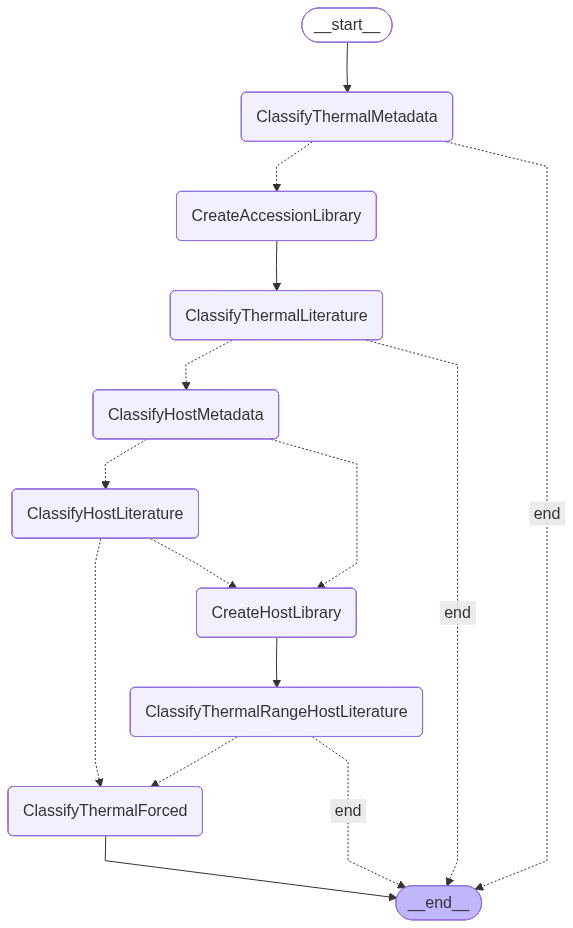
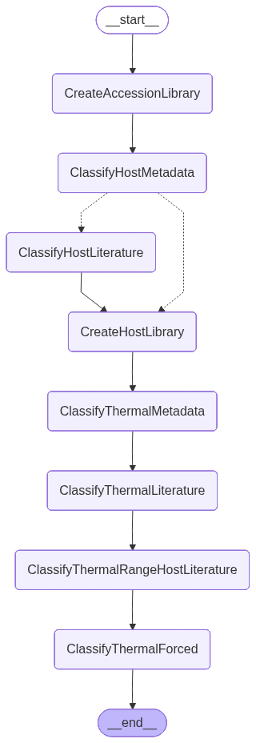
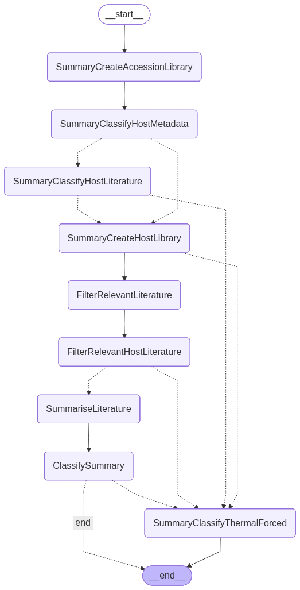

# TMP — Agentic Thermal Classification Toolkit

TMP is a Python-based bioinformatics toolkit for **phage metadata analysis**, **host prediction**, and **thermal range classification** using agentic workflows built on LangGraph and LLMs.

It provides both a **Python API** and a **command-line interface (CLI)** for running automated inference pipelines on NCBI accession IDs.

---

## 🚀 Features

- Fetches NCBI metadata for phage accessions  
- Agentic workflows using LangGraph  
- Thermal classification (mesophile / thermophile / psychrophile)  
- Host prediction and taxonomic inference  
- Literature-aware reasoning from local paper corpora  
- Three pipeline modes:
  - Fast inference pipeline  
  - Democratic voting-based inference  
  - Summary generation pipeline  
- CLI tool for single or batch processing  
- Structured JSON outputs for downstream analysis  

---

## 📦 Installation

### Recommended: editable install (development)

```bash
git clone https://github.com/JDuarteNiemen/agentic_thermal_classifier.git
cd agentic_thermal_classifier
pip install -e .
```

---

## 🖥️ CLI Usage

After installation, the `TMP` command becomes available:

### Fast pipeline

```bash
TMP fast NC_001416
```

### Democratic pipeline

```bash
TMP democratic NC_001416
```

### Summary pipeline

```bash
TMP summary NC_001416
```

---

## 🧠 Python API Usage

```python
from tmp_software import FastTMP, DemocraticTMP, SummaryTMP

result = FastTMP("NC_001416", model="llama3")

print(result)
```

---

## 📁 Output Structure

TMP generates structured outputs per accession:

```
data/accessions/<ACCESSION>/

├── metadata.json
├── library/
│   ├── accession_lit/
│   └── host_lit/
├── reasoning/
│   └── reasoning.txt
└── summary/
    └── summary.txt
```

---

## 🤖 Model Configuration
TMP uses local LLMs via **Ollama (ChatOllama backend)**.

### ✅ Default model (recommended)
```text
gemma4:e4b
```

This is the **default and recommended model** for all pipelines due to its balance of:
- reasoning ability
- speed
- stability on structured biological tasks
---

### 🔄 Using other models
You can use any model that is installed locally in Ollama, for example:
- llama3
- mistral
- gemma3
- qwen2.5
- phi3
To see your installed models:

```bash
ollama list
```

---

### 🧠 How it works
TMP does NOT hardcode a single model. Instead it uses:
- `ChatOllama` (LangChain interface)
- A user-specified model name passed at runtime
Example:
```bash
TMP fast NC_001416 --model llama3
```

If no model is specified, TMP defaults to:
```text
gemma4:e4b
```

---

### ⚙️ Notes
- The model must be **already pulled in Ollama**
  ```bash
  ollama pull gemma4:e4b
  ```

- TMP assumes a local Ollama server is running:
  ```bash
  ollama serve
  ```

- Any model compatible with Ollama's chat API will work


## 🧩 Architecture (V10 Agentic System)

TMP is built around three agentic pipelines for phage thermal classification:

- Fast Classification Pipeline  
- Democratic Voting Pipeline  
- Summary-based Classification Pipeline  

All pipelines share a common foundation:
- NCBI metadata ingestion  
- Literature retrieval system  
- LangGraph execution framework  
- Local LLM inference via Ollama  

The default model is:

```text
gemma4:e4b
```

This model is recommended due to its strong performance on reasoning, structured classification tasks, and long-context agentic workflows. Any locally installed Ollama-compatible model can also be used.

---

# ⚡ Fast Classification Pipeline



The Fast pipeline prioritises speed and hierarchical fallback logic.

### 1. Metadata Loading
- Retrieve NCBI metadata for the accession
- Initialise local working directory

### 2. Metadata Thermal Check
- If thermal range exists in metadata → return immediately

### 3. Accession Literature Retrieval
- Retrieve literature associated with the accession

### 4. Accession Literature Classification
- Extract thermal signal from accession-linked papers
- If found → return result

### 5. Host Identification
- Infer host from metadata or literature
- If not found → fallback to metadata classification

### 6. Host Literature Analysis
- Retrieve host-associated literature
- Extract thermal signal if present

### 7. Forced Metadata Fallback
- Use only metadata signals:
  - taxonomy
  - isolation source
  - environmental descriptors
  - annotations

### Output
- Final thermal classification

---

# 🗳️ Democratic Classification Pipeline



The Democratic pipeline performs multi-source voting across metadata and literature evidence.

### 1. Metadata Loading
- Load accession metadata
- Initialise working library

### 2. Host Identification
- Infer host from metadata or literature
- If unavailable → proceed without host

### 3. Accession Literature Retrieval
- Collect all accession-linked papers

### 4. Accession Voting
- Metadata classification → 1 vote  
- Literature-based classifications → additional votes  

### 5. Host Literature Retrieval
- Retrieve literature for identified host (if available)

### 6. Host Voting
- Host literature contributes additional thermal votes

### 7. Vote Aggregation
- Combine all votes from:
  - metadata
  - accession literature
  - host literature

### Output
- Thermal class with highest vote count
- Full vote distribution

---

# 📄 Summary Classification Pipeline



The Summary pipeline performs deep literature synthesis before classification.

### 1. Metadata Loading
- Load accession metadata
- Initialise working directory

### 2. Literature Retrieval
- Retrieve all accession-linked literature

### 3. Literature Relevance Filtering
Each paper is evaluated using an LLM:

- Relevant → summarise and retain  
- Irrelevant → discard  

### 4. Host Extraction (Conditional)
If relevant phage literature exists:
- Extract host organism
- Retrieve and summarise host literature

If not:
- Proceed to host inference

### 5. Fallback Host Analysis
- Infer host from metadata and indirect literature signals

### 6. Metadata-Only Fallback
If no useful literature exists:
- Use metadata only for classification

### 7. Anonymisation Step
- Combine phage + host summaries
- Replace organism names with neutral placeholders:
  - “the organism”
  - “the target species”

### 8. Final LLM Classification
- Classify thermal range using:
  - anonymised summaries OR
  - metadata fallback

### Output
- Final thermal classification
- Supporting summaries (if available)

---

## 📊 Pipeline Comparison

| Pipeline | Goal | Strength |
|----------|------|----------|
| Fast | Low-latency classification | Speed |
| Democratic | Multi-source voting | Robustness |
| Summary | Literature-driven reasoning | Interpretability |

---

## 🧠 Design Principles

TMP is built around:

- Hierarchical fallback reasoning  
- Multi-source evidence aggregation  
- Separation of metadata vs literature signals  
- Agentic graph-based execution (LangGraph)  
- Local-first inference using Ollama  

---

## 📁 Project Structure

```
src/
└── tmp_software/
    ├── api.py          # Core pipelines
    ├── cli.py          # CLI interface (Typer)
    ├── graphs.py       # LangGraph definitions
    ├── papers.py       # Metadata + literature tools
    ├── nodes.py        # Graph nodes
    ├── prompts.py      # LLM prompts
    ├── states.py       # Typed state definitions
    └── tools.py        # Utilities
```

---

## 🧪 Example Output

```json
{
  "accession": "NC_001416",
  "phage": "Escherichia virus lambda",
  "host": "Escherichia coli",
  "thermal_range": "mesophile"
}
```

---

## 🧠 Notes

- TMP uses agentic graph-based reasoning (LangGraph)  
- Outputs depend on model + literature availability  
- Designed for research and extensibility  

---

## ⚠️ Known Limitations

- Requires valid NCBI accession IDs  
- Performance depends on LLM backend  


---

## 📜 License

free to use

---

## 🤝 Future Work

- Batch accession processing  
- Streaming graph execution logs

```