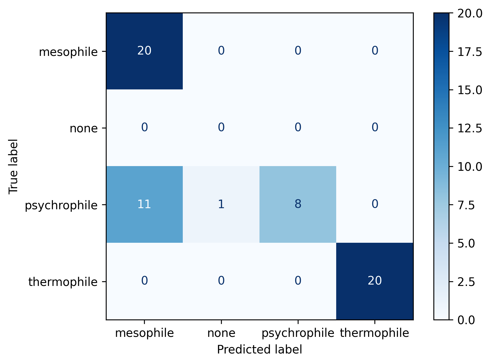

# Model Benchmarking

**Model:** qwen3.5  

## Overview
This branch adds a new strategy for classifying proteins into a thermal range.
It is a more comprehensive and longer version. ach paper is used as a vote for the final classification

Expanded dataset to 20 of each thermal range
Moving forward using gemma4 due to its performance in speed and accuracy

# Democratic Results

              precision    recall  f1-score   support

   mesophile       0.65      1.00      0.78        20
        none       0.00      0.00      0.00         0
psychrophile       1.00      0.40      0.57        20
 thermophile       1.00      1.00      1.00        20

    accuracy                           0.80        60
   macro avg       0.66      0.60      0.59        60
weighted avg       0.88      0.80      0.79        60

 Total Duration: 142.82 minutes

Democratic version results in one more correct classification for mesophiles, however there is still very poor performance
for psychrophiles
The exact same results are acquired from the fast classification and the democratic classification in terms of pychrophiles.
Mesophiles see a performance increase with one extra correct classification
