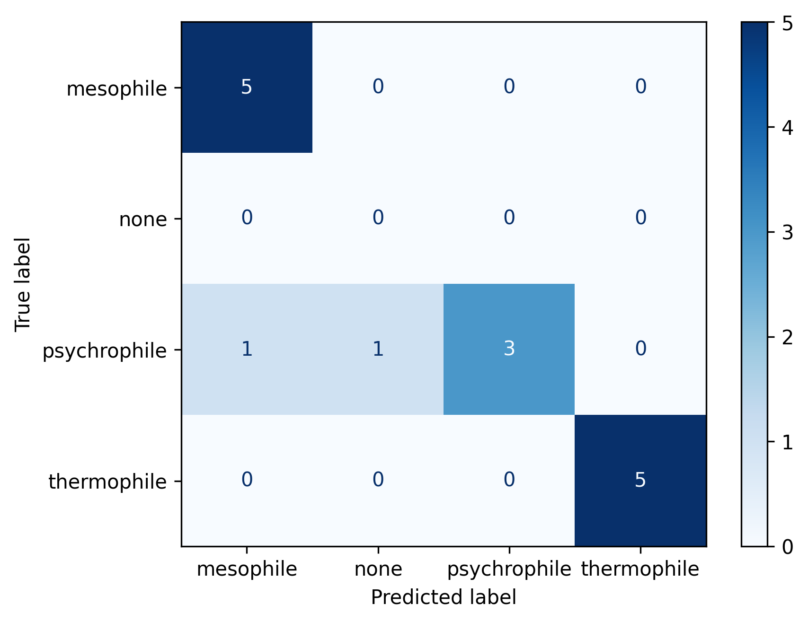
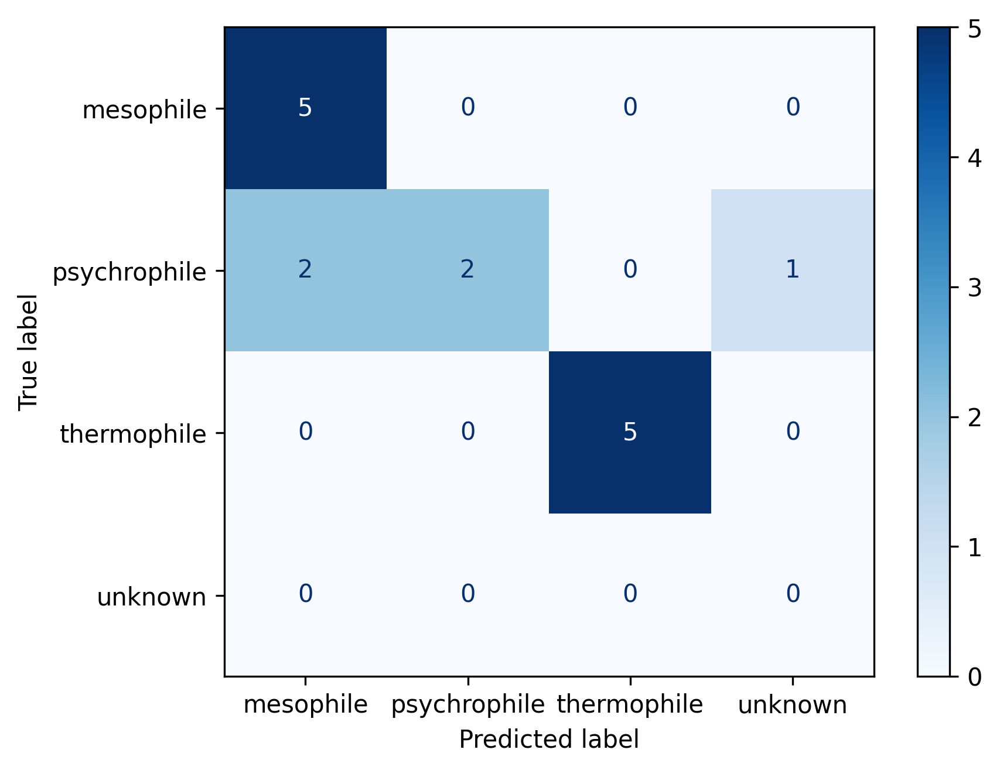
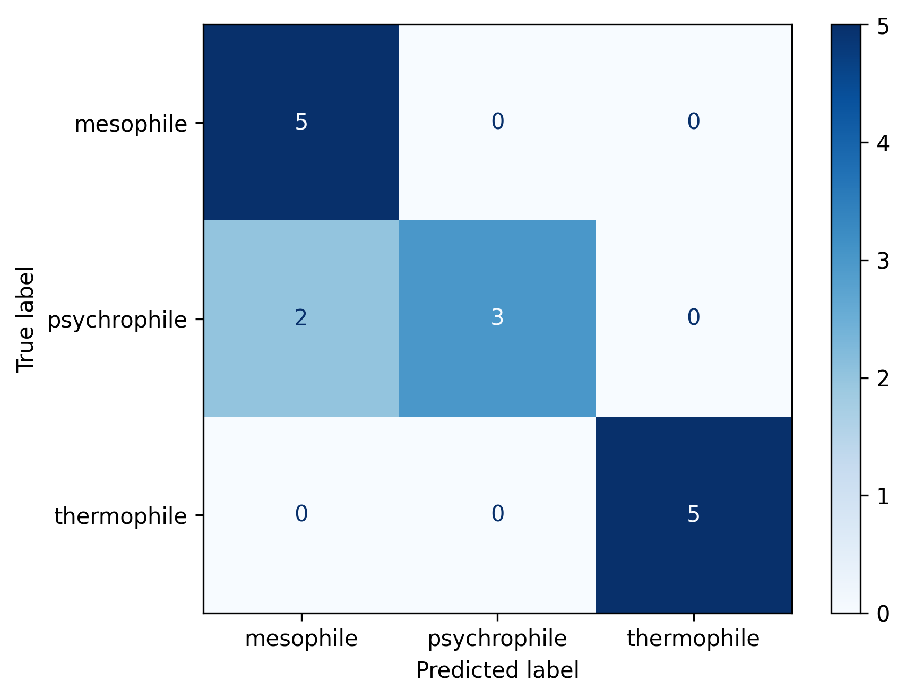
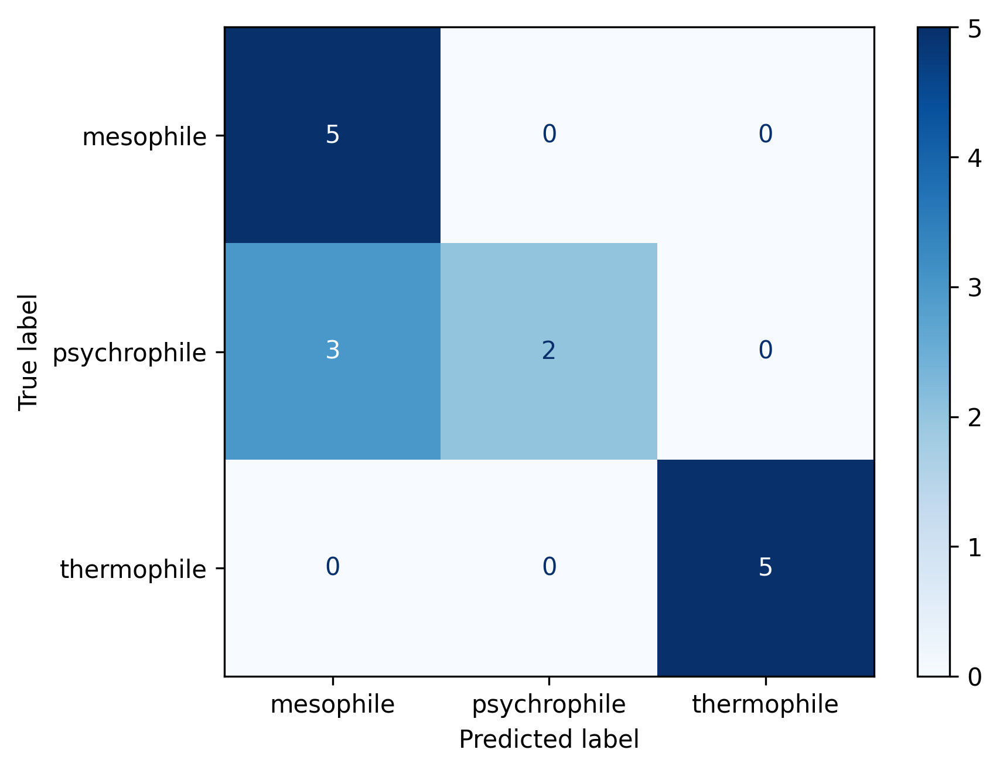
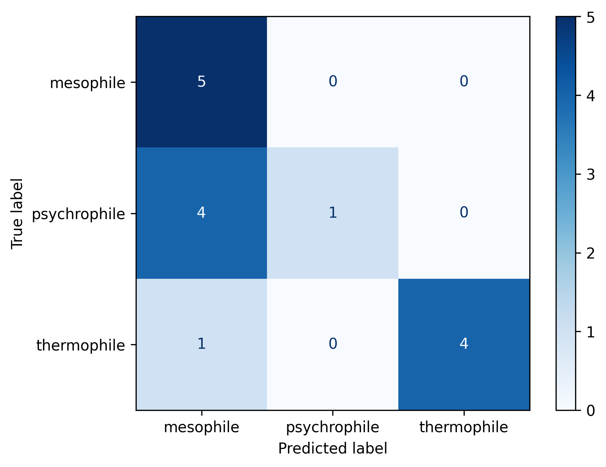

# Model Benchmarking

**Model:** qwen3.5  

## Overview
Testing how various models performed

# V5 Results

## QWEN3.5

              precision    recall  f1-score   support

   mesophile       0.83      1.00      0.91         5
        none       0.00      0.00      0.00         0
psychrophile       1.00      0.60      0.75         5
 thermophile       1.00      1.00      1.00         5

    accuracy                           0.87        15
   macro avg       0.71      0.65      0.66        15
weighted avg       0.94      0.87      0.89        15

## GEMMA4

              precision    recall  f1-score   support

   mesophile       0.71      1.00      0.83         5
psychrophile       1.00      0.40      0.57         5
 thermophile       1.00      1.00      1.00         5
     unknown       0.00      0.00      0.00         0

    accuracy                           0.80        15
   macro avg       0.68      0.60      0.60        15
weighted avg       0.90      0.80      0.80        15

 Total Duration: 7.41 minutes

## GRANITE4.1

              precision    recall  f1-score   support

   mesophile       0.71      1.00      0.83         5
psychrophile       1.00      0.60      0.75         5
 thermophile       1.00      1.00      1.00         5

    accuracy                           0.87        15
   macro avg       0.90      0.87      0.86        15
weighted avg       0.90      0.87      0.86        15

 Total Duration: 4.62 minutes
 

Highlighted that both gemma4 and granite4.1 are much faster than qwen3.5. Using v5s structured outputs qwen3.5 sometimes raises issues.
granite always returns a classification unlike gemma4 and qwen3.5 which sometimes returns a null even after forced classification

# No Context Results

## QWEN3.5

              precision    recall  f1-score   support

   mesophile       0.71      1.00      0.83         5
psychrophile       1.00      0.60      0.75         5
 thermophile       1.00      1.00      1.00         5

    accuracy                           0.87        15
   macro avg       0.90      0.87      0.86        15
weighted avg       0.90      0.87      0.86        15

Full Duration: 0.5488333333333333 minutes

## GEMMA4

              precision    recall  f1-score   support

   mesophile       0.62      1.00      0.77         5
psychrophile       1.00      0.40      0.57         5
 thermophile       1.00      1.00      1.00         5

    accuracy                           0.80        15
   macro avg       0.88      0.80      0.78        15
weighted avg       0.88      0.80      0.78        15

Full Duration: 0.3635 minutes

## GRANITE4.1

              precision    recall  f1-score   support

   mesophile       0.50      1.00      0.67         5
psychrophile       1.00      0.20      0.33         5
 thermophile       1.00      0.80      0.89         5

    accuracy                           0.67        15
   macro avg       0.83      0.67      0.63        15
weighted avg       0.83      0.67      0.63        15

Full Duration: 0.4563333333333333 minutes

Again these highlight the speed performance of the other models. Classification performance is highest with qwen3.5. 
However these results may highlight more biases in training data than the actual model performances
