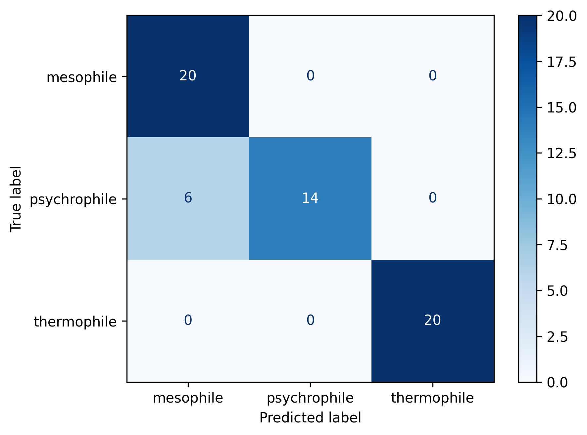

# Model Benchmarking

**Model:** gemma4  

## Overview
This branch adds a new strategy for classifying proteins into a thermal range.
This will be a version that summarises all relevant papers into a single document that will be given to an LLM to classify
Expanded dataset to 20 of each thermal range
Moving forward using gemma4 due to its performance in speed and accuracy

# Summary Results

              precision    recall  f1-score   support

   mesophile       0.77      1.00      0.87        20
psychrophile       1.00      0.70      0.82        20
 thermophile       1.00      1.00      1.00        20

    accuracy                           0.90        60
   macro avg       0.92      0.90      0.90        60
weighted avg       0.92      0.90      0.90        60

 Total Duration: 210.05 minutes

Summary results causes a large jump in classification results. A much larger improvement for psychrophiles. However it
much longer. 
