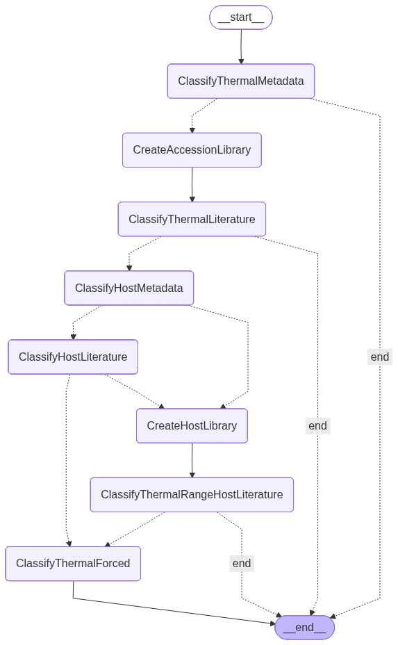
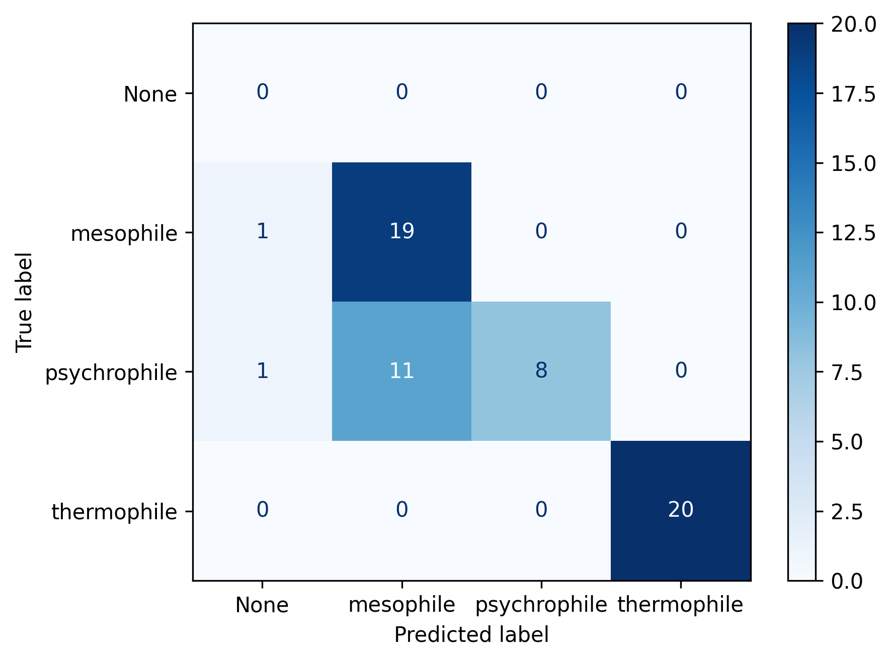

# Version 4 (V4)

**Model:** qwen3.5  

## Overview
Version 4 (V4) builds on V3 by introducing a more structured agent architecture,
including early-stage graph-based orchestration and improved state handling, while retaining the fast, metadata-first extraction pipeline.

---

## Pipeline Steps

### 1. Accession Library Creation
- Builds a structured library of all accession records for downstream processing.

---

### 2. Thermal Identification from Metadata
- Scans metadata to determine whether thermal range information is already present.

#### IF thermal range is found:
- Return thermal range

#### IF NOT:
- Proceed to literature retrieval

---

### 3. Accession-linked Literature Analysis
- Retrieves literature associated with the accession for thermal inference.

---

### 4. Thermal Range Identification from Accession Literature
- Classifies thermal range using accession-linked literature.

#### IF thermal range is found:
- Return thermal range

#### IF NOT:
- Proceed to host identification step

---

### 5. Host Identification
- Identifies host organism associated with the accession.

#### IF host is NOT found:
- Perform forced classification using metadata
- Return thermal range

#### IF host IS found:
- Proceed to host literature retrieval

---

### 6. Literature Retrieval for Host (Query Search)
- Retrieves literature associated with the identified host.

---

### 7. Thermal Range Identification from Host Literature
- Classifies thermal range using host-associated literature.

#### IF thermal range is found:
- Return thermal range

#### IF NOT:
- Proceed to final fallback classification

---

### 8. Forced Classification Using Phage Metadata
- Applies final fallback thermal classification using phage-level metadata.

#### Output:
- Return thermal range

---

## Architecture Updates

### Agent Reuse
- Currently uses the same agents as V3 for consistency and stability.

### Graph-Based Agent System (In Progress)
- Transitioning from linear execution to a graph-based agent workflow.
- Enables more flexible routing between tasks and better scalability.

### State Management (In Progress)
- Defining and refining a structured state representation for agent interactions.
- Aims to improve traceability, debugging, and extensibility.

---

# Results

# Classification report
              precision    recall  f1-score   support

   mesophile       1.00      0.83      0.91         6
        none       0.00      0.00      0.00         1
psychrophile       0.60      1.00      0.75         3
 thermophile       1.00      1.00      1.00         5

    accuracy                           0.87        15
   macro avg       0.65      0.71      0.66        15
weighted avg       0.85      0.87      0.85        15

## Key Improvements

### Improved Output Formatting
- Cleaner, more structured results for easier interpretation.

### Reduced Latency
- Reasoning disabled in LLM calls, significantly reducing execution time.

### Efficient Processing Strategy
- Metadata-first approach minimises unnecessary full-text analysis.

---

## Notes
- V4 focuses more on system architecture than major pipeline changes.
- Graph and state systems are still under active development.
- Designed to support future expansion into more complex multi-agent workflows.